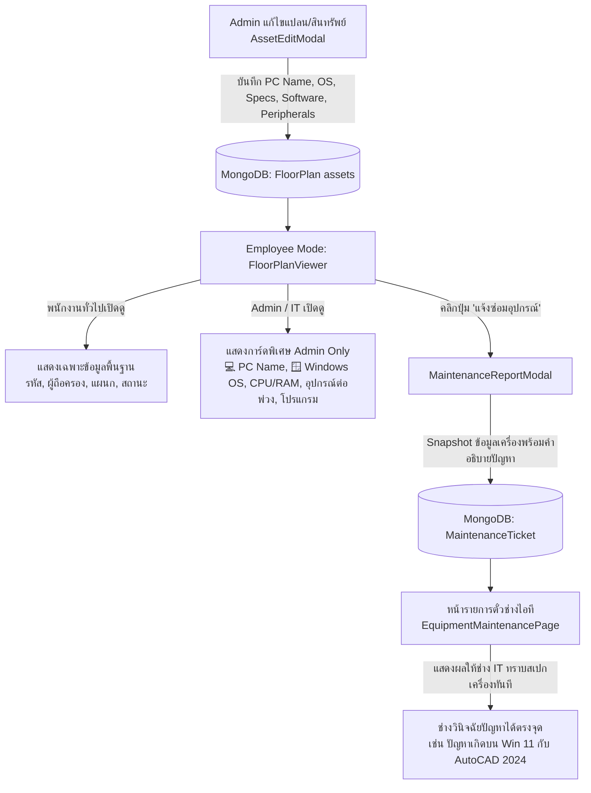

# แผนการพัฒนา: ระบบแสดงข้อมูลสเปกคอมพิวเตอร์เชิงลึกสำหรับ Admin ใน 👁️ Employee Mode และการเชื่อมโยงสู่ IT Tickets

## 1. Goal Description

เพิ่มขีดความสามารถให้ **บัญชี Admin / เจ้าหน้าที่ IT** สามารถมองเห็นข้อมูลฮาร์ดแวร์ ซอฟต์แวร์ และระบบปฏิบัติการของเครื่องคอมพิวเตอร์ได้อย่างละเอียดเมื่อคลิกดูอุปกรณ์ในโหมด **👁️ Employee Mode (FloorPlanViewer)** พร้อมทั้งเชื่อมโยงข้อมูลเครื่องนี้แบบ **Snapshot** เข้าสู่ระบบ **IT Maintenance Tickets** โดยอัตโนมัติ เพื่อให้ช่างไอทีทราบสเปกและโปรแกรมของเครื่องที่มีปัญหาได้ทันทีโดยไม่ต้องถามซ้ำ

### ข้อมูลที่จะเพิ่มเติมในระบบ:
1. **PC Name / Hostname**: เช่น `FTI-NB-IT01`, `FTI-PC-ACC05` (พร้อมปุ่มกดคัดลอก 📋)
2. **ระบบปฏิบัติการ (Operating System)**: เช่น `Windows 11 Pro 23H2 (64-bit)`, `Windows 10 Enterprise`, `macOS Sonoma`
3. **สเปกฮาร์ดแวร์หลัก**:
   - **CPU**: เช่น `Intel Core i7-13700H @ 2.40 GHz`
   - **RAM**: เช่น `16 GB DDR5`
   - **Storage**: เช่น `512 GB NVMe SSD`
4. **อุปกรณ์ต่อพ่วง (Peripherals)**: เช่น `จอ 27" Dell 2K`, `UPS 800VA APC`, `Wireless Mouse & Keyboard`, `USB-C Docking`
5. **โปรแกรมที่ติดตั้ง (Installed Software)**: เช่น `Microsoft 365`, `AutoCAD 2024`, `SAP GUI 7.70`, `Adobe Acrobat Pro`, `Kaspersky Endpoint`

---

## 2. User Review Required

> [!IMPORTANT]
> **การควบคุมสิทธิ์การมองเห็น (Security & Role-Based Access Control):**
> - **สำหรับ Admin / Superadmin / IT Team (`canEdit` หรือ Role Admin):** จะมองเห็นการ์ด **"🖥️ ข้อมูลระบบคอมพิวเตอร์และซอฟต์แวร์ (IT Specifications)"** แบบละเอียดครบถ้วนทุกรายการ
> - **สำหรับพนักงานทั่วไป (Non-Admin):** จะมองเห็นเฉพาะข้อมูลพื้นฐาน (รหัสทรัพย์สิน, ชื่อผู้ครอบครอง, แผนก, สถานะเครื่อง) โดย **ไม่เปิดเผย** Hostname ภายใน, สเปกละเอียด หรือรายการลิขสิทธิ์ซอฟต์แวร์ เพื่อความปลอดภัยตามมาตรฐาน IT Security
>
> **การเชื่อมโยงสู่ IT Maintenance Tickets:**
> - เมื่อมีการเปิดแจ้งซ่อม (Create Ticket) จากผังอาคาร ระบบจะนำ PC Name, Windows Version, CPU/RAM/Storage, อุปกรณ์ต่อพ่วง และรายการโปรแกรมที่ติดตั้ง บันทึกเป็น Snapshot ลงใน Ticket อัตโนมัติ
> - ในหน้ารายการแจ้งซ่อม (`/maintenance`) และหน้าต่างอัปเดตงานของช่าง IT จะมีการ์ดแสดงสเปกเครื่องที่มีปัญหาอย่างชัดเจน

---

## 3. Architecture & Data Flow



---

## 4. Proposed Changes

### A. Database Models & Backend

#### 1. [`server/src/models/FloorPlan.js`](file:///Users/krittapasthipsangwong/Desktop/WEBDEV/FTI/FTI_Newcomer_Portal/server/src/models/FloorPlan.js)
เพิ่มฟิลด์ใน `assetSchema`:
```javascript
    // IT Computer & Workstation Specs Fields
    pcName: { type: String, trim: true, default: '' },
    osVersion: { type: String, trim: true, default: '' },
    cpu: { type: String, trim: true, default: '' },
    ram: { type: String, trim: true, default: '' },
    storage: { type: String, trim: true, default: '' },
    peripherals: { type: [String], default: [] },
    installedSoftware: { type: [String], default: [] },
```

#### 2. [`server/src/models/MaintenanceTicket.js`](file:///Users/krittapasthipsangwong/Desktop/WEBDEV/FTI/FTI_Newcomer_Portal/server/src/models/MaintenanceTicket.js)
เพิ่มฟิลด์ Snapshot ลงในตั๋วแจ้งซ่อม:
```javascript
    // Machine & IT Diagnostics Snapshot
    pcName: { type: String, trim: true, default: '' },
    osVersion: { type: String, trim: true, default: '' },
    cpu: { type: String, trim: true, default: '' },
    ram: { type: String, trim: true, default: '' },
    storage: { type: String, trim: true, default: '' },
    specs: { type: String, trim: true, default: '' },
    peripherals: { type: [String], default: [] },
    installedSoftware: { type: [String], default: [] },
```

#### 3. [`server/src/routes/maintenanceTickets.js`](file:///Users/krittapasthipsangwong/Desktop/WEBDEV/FTI/FTI_Newcomer_Portal/server/src/routes/maintenanceTickets.js)
- ปรับปรุง endpoint `POST /` ให้บันทึกฟิลด์ไอที (`pcName`, `osVersion`, `cpu`, `ram`, `storage`, `peripherals`, `installedSoftware`)
- ปรับปรุงค้นหา `$or` ใน `GET /` ให้ค้นหาด้วย `pcName` และ `osVersion` ได้

---

### B. Frontend Components

#### 1. [`client/src/components/floorplan/FloorPlanViewer.jsx`](file:///Users/krittapasthipsangwong/Desktop/WEBDEV/FTI/FTI_Newcomer_Portal/client/src/components/floorplan/FloorPlanViewer.jsx)
- ในลิ้นชักแสดงรายละเอียดทรัพย์สิน (`selectedAsset` drawer):
  - ตรวจสอบ `canEdit` (สิทธิ์ Admin):
    - หากเป็น Admin และอุปกรณ์เป็นประเภท `computer` (หรือมีข้อมูลระบบ):
      - แสดง Badge ชื่อเครื่อง **PC Name** พร้อมปุ่ม Copy
      - แสดง Badge ระบบปฏิบัติการ **🪟 Windows OS**
      - แสดง Grid สเปกเครื่อง (CPU, RAM, Storage, Specs)
      - แสดงกล่องรายการ **อุปกรณ์ต่อพ่วง (Peripherals)** เป็นชิปสี Slate
      - แสดงกล่องรายการ **โปรแกรมที่ติดตั้ง (Installed Software)** เป็นชิปสี Indigo/Blue
    - หากเป็นพนักงานทั่วไป: แสดงเฉพาะข้อมูลพื้นฐาน ไม่เปิดเผยข้อมูลระบบเชิงลึก

#### 2. [`client/src/components/floorplan/AssetEditModal.jsx`](file:///Users/krittapasthipsangwong/Desktop/WEBDEV/FTI/FTI_Newcomer_Portal/client/src/components/floorplan/AssetEditModal.jsx)
- เพิ่มส่วนฟอร์มสำหรับอุปกรณ์ประเภท `computer`:
  - ช่องกรอก **PC Name / Hostname**
  - ช่องกรอก/เลือก **ระบบปฏิบัติการ (Windows 11 Pro, Windows 10 Pro, macOS, ฯลฯ)**
  - ช่องกรอก **CPU, RAM, Storage**
  - ช่องกรอก **อุปกรณ์ต่อพ่วง (Peripherals)** (ป้อนคั่นด้วยจุลภาค พร้อมแปลงเป็นชิป)
  - ช่องกรอก **โปรแกรมที่ติดตั้ง (Installed Software)** (ป้อนคั่นด้วยจุลภาค พร้อมแปลงเป็นชิป)

#### 3. [`client/src/components/floorplan/MaintenanceReportModal.jsx`](file:///Users/krittapasthipsangwong/Desktop/WEBDEV/FTI/FTI_Newcomer_Portal/client/src/components/floorplan/MaintenanceReportModal.jsx)
- แนบข้อมูล `pcName`, `osVersion`, `cpu`, `ram`, `storage`, `specs`, `peripherals`, `installedSoftware` ไปใน payload ของการสร้าง Ticket
- แสดงตัวอย่างสเปกเครื่องในโมดอลแจ้งซ่อมหากผู้แจ้งต้องการดูข้อมูลเครื่องที่กำลังแจ้ง

#### 4. [`client/src/pages/EquipmentMaintenancePage.jsx`](file:///Users/krittapasthipsangwong/Desktop/WEBDEV/FTI/FTI_Newcomer_Portal/client/src/pages/EquipmentMaintenancePage.jsx)
- ในการ์ดแสดง Ticket:
  - หากตั๋วมีข้อมูลเครื่องคอมพิวเตอร์:
    - แสดงแถบข้อมูลเครื่อง: `💻 [PC Name] • 🪟 [Windows Version]`
    - เพิ่มปุ่มกดขยายดู "🖥️ สเปกเครื่องและโปรแกรม (Machine Details)" เพื่อให้ช่างไอทีกดดู CPU, RAM, Storage, อุปกรณ์ต่อพ่วง และโปรแกรมที่ติดตั้งได้ทันที
- ในหน้าต่าง Status Update Modal (อัปเดตงานของช่าง):
  - แสดงการ์ดสรุปข้อมูลเครื่องและโปรแกรม เพื่อให้ช่างมีข้อมูลครบถ้วนขณะบันทึกผลการซ่อม

#### 5. [`client/src/i18n/messages.js`](file:///Users/krittapasthipsangwong/Desktop/WEBDEV/FTI/FTI_Newcomer_Portal/client/src/i18n/messages.js)
- เพิ่มคำแปลภาษาไทยและภาษาอังกฤษสำหรับทุกฟิลด์ใหม่ (PC Name, OS Version, CPU, RAM, Storage, Peripherals, Installed Software, Copy, etc.)

---

## 5. Verification Plan

### Automated Tests
```bash
# 1. รัน Vitest Unit Tests
cd client && npx vitest run src/utils/__tests__/cadAndPolygon.test.js

# 2. ตรวจสอบการ Build Client
cd client && npm run build
```

### Manual & Browser Verification (DevTools Subagent)
1. เข้าโหมด Admin และแก้ไขข้อมูลคอมพิวเตอร์ในผังอาคาร กรอก PC Name (`FTI-NB-IT01`), Windows Version (`Windows 11 Pro 23H2`), CPU (`i7-13700H`), RAM (`16 GB`), Storage (`512 GB SSD`), อุปกรณ์ต่อพ่วง (`จอ Dell 27"`, `UPS 800VA`), โปรแกรมที่ติดตั้ง (`Office 365`, `AutoCAD 2024`)
2. เปิดดูในโหมด **👁️ Employee Mode** ในฐานะ **Admin**:
   - ยืนยันว่าการ์ดข้อมูลเครื่องแสดงครบถ้วนสวยงาม มีปุ่มกดคัดลอกชื่อเครื่อง
3. เปิดดูในฐานะ **พนักงานทั่วไป (Non-Admin)**:
   - ยืนยันว่าข้อมูลเชิงลึกถูกซ่อน แสดงเฉพาะข้อมูลพื้นฐาน
4. กดแจ้งซ่อมจากอุปกรณ์ดังกล่าว (Create Ticket):
   - ยืนยันว่า Ticket ถูกสร้างขึ้นพร้อมข้อมูล Snapshot เครื่อง
5. เปิดหน้า `/maintenance` ตรวจสอบตั๋วแจ้งซ่อม:
   - ยืนยันว่าช่างไอทีเห็นแถบ PC Name, Windows Version, รายการโปรแกรม และอุปกรณ์ต่อพ่วงครบถ้วน
